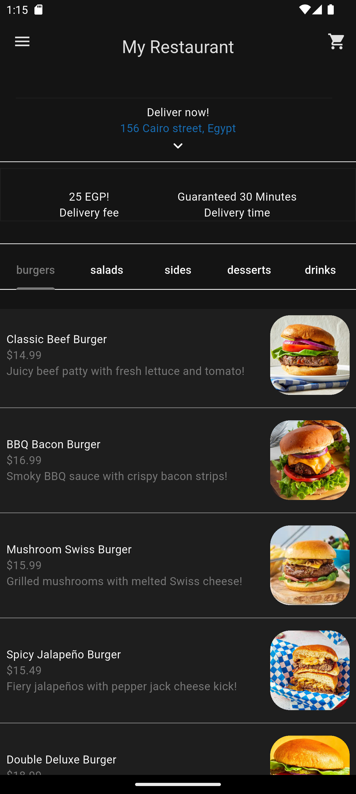

# 🍔 Food Delivery App

A modern, feature-rich food delivery application built with Flutter and Firebase. This app provides a seamless experience for users to browse menus, customize orders, and track deliveries.

## ✨ Features

### 🔐 Authentication
- **User Registration & Login**: Secure email/password authentication with Firebase Auth
- **Session Management**: Persistent login state across app sessions
- **Guest Protection**: Auth gate ensures only authenticated users can access the app

### 🏠 Home Experience
- **Interactive Menu**: Browse food items organized by categories (Burgers, Salads, Sides, Desserts, Drinks)
- **Tabbed Navigation**: Easy category switching with smooth animations
- **Food Details**: Detailed view of each item with images, descriptions, and pricing
- **Location Display**: Current delivery address with search functionality

### 🛒 Shopping Cart
- **Add to Cart**: Select items with customizable add-ons
- **Quantity Management**: Increase/decrease item quantities
- **Real-time Updates**: Live cart total calculation
- **Smart Grouping**: Automatically groups identical items with same add-ons

### 🧩 Customization
- **Add-ons System**: Extensive customization options for each food item
- **Dynamic Pricing**: Real-time price updates based on selections
- **Visual Feedback**: Clear indication of selected options

### 💳 Payment Integration
- **Credit Card Processing**: Secure payment with flutter_credit_card package
- **Form Validation**: Comprehensive payment form validation
- **Payment Confirmation**: Review order details before payment

### 📦 Order Management
- **Digital Receipts**: Detailed order receipts with timestamps
- **Order History**: Firebase Firestore integration for order persistence

### 🎨 User Interface
- **Theme Support**: Light and dark mode with system preference detection
- **Material Design**: Clean, modern UI following Material Design principles
- **Responsive Layout**: Optimized for various screen sizes
- **Custom Components**: Reusable UI components for consistent design

## 🏗️ Architecture

### Project Structure
```
lib/
├── components/          # Reusable UI components
├── model/              # Data models and business logic
├── pages/              # App screens and navigation
├── services/           # External service integrations
│   ├── auth/          # Authentication services
│   └── database/      # Database operations
└── themes/            # App theming and styling
```

### Design Patterns
- **Provider Pattern**: State management using Provider package
- **Repository Pattern**: Clean separation of data sources
- **Component-Based Architecture**: Modular, reusable UI components

## 🚀 Getting Started

### Prerequisites
- Flutter SDK (3.0+)
- Dart SDK (2.17+)
- Firebase project setup
- Android Studio / VS Code

### Installation

1. **Clone the repository**
   ```bash
   git clone https://github.com/your-username/food-delivery-app.git
   cd food-delivery-app
   ```

2. **Install dependencies**
   ```bash
   flutter pub get
   ```

3. **Firebase Setup**
   - Create a new Firebase project at [Firebase Console](https://console.firebase.google.com)
   - Enable Authentication (Email/Password)
   - Enable Firestore Database
   - Download configuration files:
     - `google-services.json` for Android (place in `android/app/`)
     - `GoogleService-Info.plist` for iOS (place in `ios/Runner/`)

4. **Configure Firebase**
   ```bash
   flutter pub add firebase_core
   flutter pub add firebase_auth
   flutter pub add cloud_firestore
   flutterfire configure
   ```

5. **Run the application**
   ```bash
   flutter run
   ```

## 📱 Screenshots

| Home Screen | Food Details | Cart | Payment |
|------------|-------------|------|---------|
|  |  |  |  |

## 🛠️ Dependencies

### Core Dependencies
```yaml
dependencies:
  flutter:
    sdk: flutter
  firebase_core: ^2.24.2
  firebase_auth: ^4.15.3
  cloud_firestore: ^4.13.6
  provider: ^6.1.1
  flutter_credit_card: ^4.0.1
  collection: ^1.17.0
  intl: ^0.18.0
```

### Key Packages
- **Firebase Core**: Firebase SDK initialization
- **Firebase Auth**: User authentication
- **Cloud Firestore**: NoSQL database for orders
- **Provider**: State management solution
- **Flutter Credit Card**: Credit card input UI
- **Collection**: Advanced collection operations
- **Intl**: Internationalization and date formatting

## 🔧 Configuration

### Firebase Rules
```javascript
// Firestore Security Rules
rules_version = '2';
service cloud.firestore {
  match /databases/{database}/documents {
    match /orders/{document} {
      allow read, write: if request.auth != null;
    }
  }
}
```

### Environment Setup
1. Update `firebase_options.dart` with your Firebase configuration
2. Ensure proper iOS bundle ID and Android package name
3. Configure Firebase Authentication providers
4. Set up Firestore database rules


## 🔐 Security Features

- **Authentication Required**: All app features require user login
- **Secure Firebase Rules**: Firestore rules protect user data
- **Input Validation**: Comprehensive form validation
- **Error Handling**: Graceful error management throughout the app

## 🎨 Customization

### Adding New Food Categories
```dart
// In lib/model/food.dart
enum FoodCategory { 
  burgers, 
  salads, 
  sides, 
  desserts, 
  drinks,
  // Add your new category here
  newCategory
}
```

### Custom Themes
```dart
// In lib/themes/
ThemeData customTheme = ThemeData(
  colorScheme: ColorScheme.light(
    surface: Colors.your_color,
    primary: Colors.your_color,
    // Customize as needed
  ),
);
```

